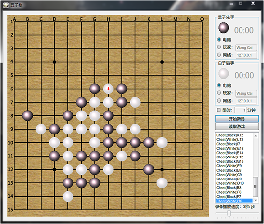

Gobang
======

Some Gobang games with very high Artificial Intelligence

- Gobang in ASM:

  - A Gobang game written in x86 assembly. 
  - It supports inter-computer games and can show a countdown timer in the nixie tubes.  
  - The chessboard will be displayed both in the screen and an LED matrix. 

- Gobang with GUI:

  - A Gobang game written in C#, with full network support. 
  - The white side is the server and the black is the client. 
  - Players can input the IP of the opposite side to play Gobang online. 
  - Players can also save and load the games or replay completed games.

